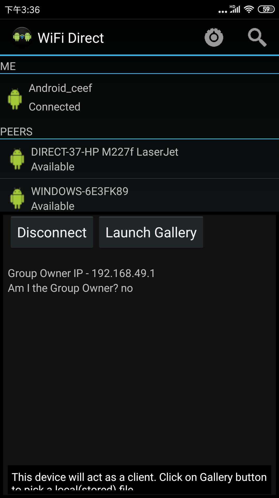

# WiFiDirectDemo
说明：根据官方的demo整理成Andorid Studio中可编译的项目，并添加测试用例。

官方文档：[WLAN 直连（对等连接或 P2P）概览](https://developer.android.google.cn/guide/topics/connectivity/wifip2p)
官方源码链接：[WiFiDirectDemo](https://android.googlesource.com/platform/development/+/master/samples/WiFiDirectDemo/)

测试安装包：
在apk目录下，文件名为：`wifidirectDemo.apk`。

测试用例：
测试之前，记得首先打开手机WiFi,否则部分手机可能出现闪退的问题。

1. 同一局域网场景：
两个手机连接WLAN热点：如`Fiture(2.4G/5G)`，在同一个网络下。
运行结果：两个手机能正常通信，能正常收发图片。

2. 同一局域网分离出两个路由：
  一个手机连接WLAN热点：如`Fiture-Slim(5G)`，另一个手机连接`Fiture（2.4G/5G）`。

  运行结果：两个手机能正常通信，能正常收发图片。

3. AP隔离场景：
  一个手机连接4G网络虚拟的`人个热点`，一个手机连接`Fiture（2.4G/5G）`。
  运行结果：两个手机能正常通信，能正常收发图片。

4. 开发板的测试场景（同上述三种测试场景）

运行截图：

